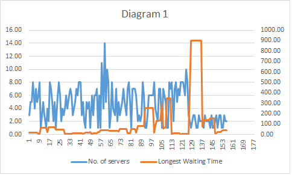
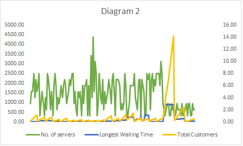
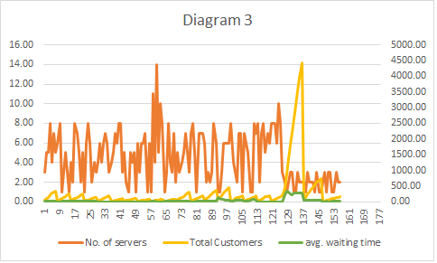
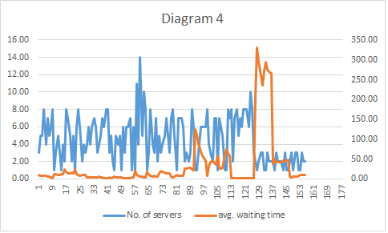

# Assign-customers-from-QueueToServers_or_Counters

## Description

This algorithm helps to find the current, longest and average waiting time for customers in queue waiting for their turn. Through this, one can also determine the no. of servers/counters for the booking system to provide.

## Purpose

1.	Assign each customer to the counter in such a way that their waiting time would be minimum.
2.	Determine the no. of required servers/counters/attendants at any booking system.

## Parameters 

1.	No. of servers: generated randomly by the system 
2.	No. of customers: generated randomly by the system
3.	Service time for each customer: generated randomly by the system
4.	Time for running the experiment: Determined initially by the programmer

## Computation Procedure

*	First of all, we generate or initialize the parameters.
*	Next, we make a queue of the customers and enqueue them as they are generated.
*	We also assign customers to respective counters based on the least waiting time of the counter. 
*	While assigning the customers to their respective counters, we calculate their waiting time based on the service time of the customers ahead.
*	We check if the longest waiting time is smaller than the current waiting time. If it is, we assign the current waiting time as the longest waiting time.
*	We then deque the customers as soon as their turn has completed.
*	Based on the results we obtain for 5 units of time, we generated graphs according to the simulation results.

## What would be the output?

### We will get the following outputs at the end of the experiment:
1.	Current waiting time of each customer during the experiment
2.	Longest waiting time in an experiment
3.	Average waiting time
4.	Max no of customers generated in 1 minute during the experiment
5.	Total no of customers in the whole experiment
6.	Total no. of servers
7.	Total no. of customers generating in each minute during the experiment

## SIMULATION RESULT
 

## DATA OBTAINED

The obtained data is shared in the excel sheet. [Click Here](https://drive.google.com/file/d/1-DMjUzoL4Qc2M8p-Yoo9RQtprTCDfp9w/view?usp=sharing) to access the data sheet.

## GRAPHS GENERATED (based on the numerical data generated)

### Conclusion: As no. of servers are increasing, longest waiting time is decreasing

### Conclusion: As no. of servers are decreasing & Total no. of are customers increasing, longest     waiting time is increasing

### Conclusion: As no. of servers are decreasing & Total no. of are customers increasing, avg.     waiting time is increasing

### Conclusion: As no. of servers are increasing, avg. waiting time is decreasing
